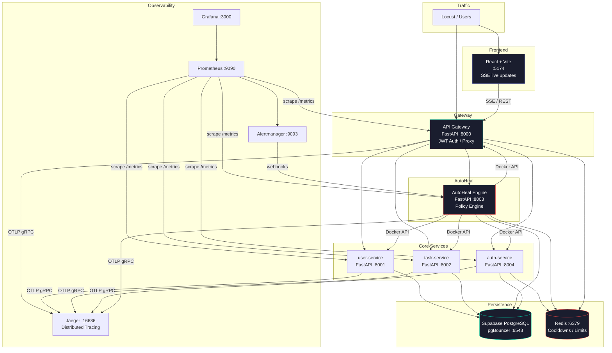

# AutoHeal AI — Architecture Documentation

## Overview

AutoHeal AI is a production-grade SRE microservices platform with automated incident detection, policy-driven remediation, full incident lifecycle management, JWT-based authentication, and multi-window SLO burn rate monitoring.

## Architecture Diagram



## Services

| Service | Port | Role |
|---|---|---|
| `api-gateway` | 8000 | Entry point, JWT auth, proxying, rate limiting |
| `auth-service` | 8004 | JWT login/register, RBAC |
| `autoheal-engine` | 8003 | Detection, policy engine, healing, SLO |
| `user-service` | 8001 | User CRUD |
| `task-service` | 8002 | Task CRUD |
| `prometheus` | 9090 | Metrics scraping |
| `alertmanager` | 9093 | Alert routing to webhook |
| `grafana` | 3000 | Dashboards |
| `jaeger` | 16686 | Distributed tracing |
| `redis` | 6379 | Cooldowns, circuit breaker, rate limiting |

## Authentication (UPGRADE 1)

All routes except `/health`, `/ready`, `/metrics`, `/auth/*`, `/docs` require a Bearer JWT token.

### Roles
- **viewer**: Read-only access to all GET endpoints
- **operator**: Full access including POST /heal, /simulate/*, DELETE methods

### Default Users
| Username | Password | Role |
|---|---|---|
| admin | admin123 | operator |
| viewer | viewer123 | viewer |

### Login
```bash
curl -X POST http://localhost:8000/auth/login \
  -H "Content-Type: application/json" \
  -d '{"username":"admin","password":"admin123"}'
# → {"token": "eyJ...", "role": "operator", ...}
```

Use the token in subsequent requests:
```bash
curl http://localhost:8000/api/incidents \
  -H "Authorization: Bearer <token>"
```

## Remediation Policy Engine (UPGRADE 2)

Policies are loaded from `config/remediation-policies.yml`. Each policy maps a detected `condition` to an `action` with cooldown, max attempts, and escalation behavior.

### Supported Actions
| Action | Description |
|---|---|
| `RESTART_SERVICE` | Restart Docker container |
| `THROTTLE_TRAFFIC` | Set Redis rate limit for service |
| `DB_FAILOVER` | Switch services to replica DB |
| `LOG_INCIDENT` | Record without executing |

### Cooldown (Redis-backed)
After executing an action, a TTL key is set in Redis. Any healing for the same service+action is skipped until expiry.

## Safety Controls (UPGRADE 3)

### Circuit Breaker
- Opens after **3 failures** in a **10-minute** window
- Resets after **15 minutes** (half-open probe)
- Per `service:action` — stored in Redis

### Blast Radius Limiter
- Max **3 services** can be actively healing simultaneously
- Counter tracked in Redis with 5-minute TTL

### Dry Run Mode
Set `HEALING_DRY_RUN=true` in `.env` or at policy level. All healing decisions are logged as `dry_run` in the audit log — no actual actions executed.

## Incident Lifecycle (UPGRADE 4)

Statuses: `open` → `acknowledged` → `investigating` → `mitigating` → `resolved`

Each incident contains:
- `timeline[]` — timestamped log of all status changes and comments
- `root_cause` — free-text root cause analysis
- `postmortem` — post-incident review text
- `metrics_snapshot` — error rate, latency, request count at time of detection
- `linked_trace_id` — trace ID for correlation with Jaeger

## Alert Correlation (UPGRADE 5)

`AlertCorrelator` deduplicates alerts using a `service:condition` fingerprint stored in Redis with a 2-minute TTL. Multiple alerts with the same fingerprint → same incident ID.

## SLO Burn Rates (UPGRADE 8)

Multi-window burn rate monitoring following the Google SRE Book standard:

| Window | Burn Rate Threshold | Alert Level |
|---|---|---|
| 5m + 1h | > 14.4x | Critical (page immediately) |
| 30m + 6h | > 6x | High (page urgently) |
| 6h | > 3x | Warning (ticket) |

```bash
# Check current SLO burn rates
curl http://localhost:8003/slo/burn-rates
```

## Audit Log (UPGRADE 3)

Every healing decision is written to the `audit_log` table with outcome:

| Result | Meaning |
|---|---|
| `executed` | Action ran successfully |
| `dry_run` | Would have run (dry-run mode) |
| `skipped` | Max attempts or no policy |
| `cooldown` | Cooldown window active |
| `circuit_open` | Circuit breaker open |
| `blast_radius` | Blast radius limit hit |
| `failed` | Action threw an exception |

```bash
make audit-log
```

## Manual Approvals (UPGRADE 3)

Policies with `escalation: require_manual_approval` insert a row into `pending_approvals`. Operators must approve before healing proceeds.

```bash
make pending-approvals
# Approve:
curl -X POST http://localhost:8003/approvals/<id>/approve \
  -H "x-user-role: operator" -H "x-user-id: admin"
```

## Webhook Integration (UPGRADE 9)

Alertmanager sends alerts to `POST /alerts/webhook`. Configure HMAC signature validation via:
```
ALERTMANAGER_WEBHOOK_SECRET=your-hmac-secret
```
Alertmanager must set `X-Alertmanager-Signature: sha256=<hmac>` header.

## Network Isolation

- All services only expose ports on the `internal` Docker network
- Only `api-gateway`, `grafana`, `jaeger`, `frontend`, `locust` are on `external`
- Backend services are never directly reachable from outside

## Quick Start

```bash
cp .env.example .env   # edit your secrets
make up                # start all services
make token-admin       # get an operator JWT
make health            # check all services
make slo-status        # view SLO burn rates
make audit-log         # view healing decisions
```
