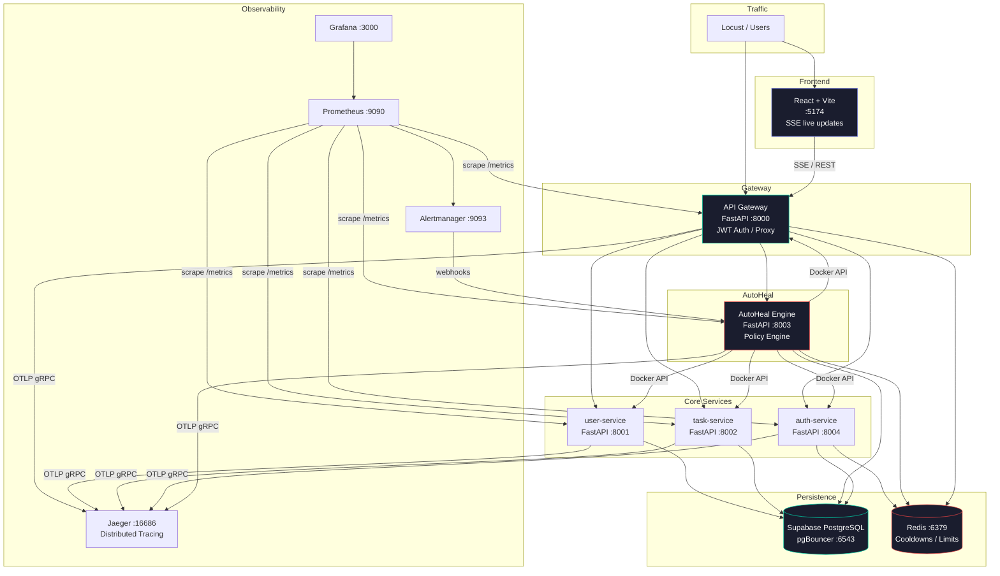

# Comprehensive Project Report: AutoHeal AI — Self-Healing Microservices Platform

## 1. Executive Summary
In the era of cloud-native computing and distributed systems, ensuring high availability and robust performance is more critical—and more challenging—than ever. Traditional monitoring solutions rely heavily on human intervention, alerting Site Reliability Engineers (SREs) when systems fail, which inherently introduces latency in the recovery process and negatively impacts Mean Time to Recovery (MTTR). **AutoHeal AI** is a comprehensive, production-grade SRE platform designed to solve this by introducing autonomous, policy-driven self-healing capabilities to a microservices architecture. By continuously analyzing real-time metrics, evaluating declarative remediation policies, and executing safe recovery actions (such as traffic throttling, database failovers, and container restarts) without human intervention, AutoHeal AI aims to maintain strict Service Level Objectives (SLOs) while protecting against cascading failures.

---

## 2. Introduction

### 2.1 Background
The shift from monolithic applications to microservices has provided unprecedented scalability and agility. However, it has also introduced complex failure domains. A single slow downstream service can exhaust connection pools, leading to cascading failures across the entire system. Site Reliability Engineering (SRE) practices advocate for treating operations as a software engineering problem. AutoHeal AI embodies this principle by codifying operational responses into the infrastructure itself.

### 2.2 Motivation
The primary motivation behind this project is to bridge the gap between passive observability and active reliability. While many organizations successfully implement monitoring (knowing *when* a system breaks), fewer implement autonomous remediation (fixing the system *automatically* when it breaks). AutoHeal AI was developed to demonstrate how these two domains can be integrated safely and effectively.

### 2.3 Project Objectives
1. **Automate Incident Response:** Eliminate the need for immediate manual intervention for known, predictable failure modes.
2. **Reduce MTTR:** Detect and remediate issues within seconds rather than minutes or hours.
3. **Ensure Safety:** Implement rigorous safety controls (circuit breakers, blast-radius limiters) so the healing mechanism does not accidentally degrade the system further.
4. **Demonstrate SRE Best Practices:** Implement multi-window SLO burn rate alerting, distributed tracing, and centralized, actionable metric dashboards.

---

## 3. Problem Statement & Challenges

### 3.1 The Cost of Manual Intervention
When a service degrades, an alert is typically fired to an on-call engineer. The engineer must acknowledge the alert, log into the system, diagnose the issue (e.g., a memory leak or a blocked database connection), and manually execute a fix (e.g., restarting the pod or throttling traffic). This human-in-the-loop process is slow, prone to error, and contributes heavily to alert fatigue.

### 3.2 Managing Cascading Failures
Microservices communicate over unreliable networks. If Service A depends on Service B, and Service B experiences a latency spike, Service A's threads will block while waiting for a response. Eventually, Service A will stop responding to the API Gateway, causing the entire platform to experience an outage.

### 3.3 The Challenge of Auto-Remediation
Automating fixes is dangerous. If a healing engine aggressively restarts services that are merely slow due to high legitimate traffic, it can cause an outage. Thus, the core challenge is not just automating the fix, but doing so safely, with strict limits on how many actions can be taken and under what circumstances.

---

## 4. System Architecture

AutoHeal AI is built on a containerized architecture utilizing Docker Compose. It is logically divided into five main layers: Traffic Management, Core Services, Persistence, The AutoHeal Engine, and the Observability Stack.

### 4.1 Component Breakdown
- **API Gateway (`:8000`)**: Acts as the single entry point. It handles JWT validation, reverse proxying to downstream microservices, global rate limiting via Redis, and maintains a Server-Sent Events (SSE) connection with the frontend for real-time telemetry.
- **Auth Service (`:8004`)**: Responsible for issuing JWTs, handling user registration, and enforcing Role-Based Access Control (RBAC).
- **Core Domain Services (User `:8001` & Task `:8002`)**: Represent the business logic of the application. They are designed to be explicitly monitored and managed by the AutoHeal engine.
- **AutoHeal Engine (`:8003`)**: The core contribution of this project. It is an intelligent daemon that continuously evaluates the state of the cluster and executes policy-driven remediation.
- **Persistence Layer**: A highly available Supabase PostgreSQL database operating behind a pgBouncer connection pooler on port 6543 to manage thousands of concurrent connections effectively. Redis (`:6379`) is utilized for high-speed ephemeral data, including rate limit counters and healing cooldowns.
- **Observability Stack**: Prometheus scrapes `/metrics` endpoints every 5 seconds. Grafana visualizes this data. Jaeger receives OTLP gRPC spans for distributed tracing of every request. Alertmanager routes critical rule violations.

---

## 5. Detailed Implementation & Technical Design

### 5.1 Authentication & Role-Based Access Control (RBAC)
Security is paramount, especially for a system capable of restarting services. The platform uses stateless JWT authentication. The `auth-service` issues tokens with distinct roles:
- **Viewer**: Granted to standard users. Allows read-only access to monitoring dashboards and GET endpoints.
- **Operator**: Granted to SREs and administrators. Provides full access to trigger incident simulations, perform manual approval of destructive healing actions, and interact with the AutoHeal API.

### 5.2 The AutoHeal Engine Mechanisms
The AutoHeal Engine operates on a continuous 5-second polling loop.
1. **Metric Acquisition:** It queries Prometheus using PromQL to determine error rates and P99 latencies for all services. It also directly pings the `/health` endpoints of downstream services.
2. **Policy Evaluation:** The engine cross-references the current system state against a declarative `remediation-policies.yml` file. 
   - *Example:* If `error_rate > 5%`, the matched policy might dictate `RESTART_SERVICE`.
   - *Example:* If `p99_latency > 500ms`, the matched policy might dictate `THROTTLE_TRAFFIC`.
3. **Execution:** If a policy matches, the Engine interfaces with the Docker API (via mounted `docker.sock`) to restart containers, or communicates with Redis to impose dynamic rate limits on the API Gateway for the degraded service.

### 5.3 Rigorous Safety Controls
To prevent "auto-destruction," the platform implements several layers of safety:
- **Cooldown Periods:** Managed via Redis TTLs. Once a service is healed (e.g., restarted), the Engine places a lock on further actions for that specific service and action type (e.g., 60 seconds) to allow the service time to recover.
- **Circuit Breakers:** If the Engine attempts to heal a service 3 times within a 10-minute window and the service remains degraded, a circuit breaker opens. The Engine will refuse to take further automated action for 15 minutes, escalating the issue to a human operator.
- **Blast Radius Limiter:** The system maintains a counter of currently degraded/healing services. If more than 3 services require healing simultaneously, the Engine assumes a massive systemic failure (e.g., a network partition) and halts all automated actions to avoid worsening the situation.
- **Dry-Run Mode:** Operators can set `HEALING_DRY_RUN=true`. The Engine will detect anomalies, evaluate policies, and log the intended action to an audit database, but will explicitly *skip* the execution phase. This is critical for testing new policies safely.
- **Manual Approvals:** High-risk policies can be tagged with `escalation: require_manual_approval`. These actions are paused until an Operator explicitly approves them via the API.

### 5.4 Incident Lifecycle & Alert Correlation
AutoHeal AI manages incidents similarly to enterprise platforms like PagerDuty.
- **Lifecycle:** `Open` → `Acknowledged` → `Investigating` → `Mitigating` → `Resolved`.
- **Alert Correlation:** To prevent "alert storms," an `AlertCorrelator` generates a cryptographic fingerprint of the `service:condition` and stores it in Redis. If 50 identical alerts fire within 2 minutes, they are deduplicated and appended to a single, unified Incident ID in PostgreSQL.
- Each incident stores a complete timeline of automated actions, the root cause analysis, and the Jaeger Trace ID corresponding to the exact request that triggered the anomaly.

---

## 6. Service Level Objectives (SLOs) & Reliability Engineering

Modern SRE practices rely heavily on SLOs rather than static thresholds. AutoHeal AI implements the Google SRE Book standard for multi-window burn rate monitoring.

### 6.1 Defined SLOs
- **Latency SLO:** 95% of all requests over a rolling 5-minute window must complete in under 200ms.
- **Availability SLO:** The system must maintain 99.0% uptime over a 24-hour period.

### 6.2 Burn Rate Alerting
Instead of alerting whenever an error occurs, the system calculates the rate at which the "Error Budget" is being consumed.
- **Critical Alert:** Burn rate > 14.4x (Evaluated over a short 5m window and confirmed over a 1h window). This means the monthly error budget will be exhausted in 2 days. The system immediately pages an operator (via Alertmanager webhooks).
- **High Alert:** Burn rate > 6x (Evaluated over 30m and 6h windows).
- **Warning:** Burn rate > 3x (Evaluated over a 6h window). Results in a non-urgent ticketing queue.

---

## 7. Simulation, Testing & Evaluation

A major feature of AutoHeal AI is its built-in chaos engineering and simulation suite.

### 7.1 Chaos Engineering Endpoints
The API Gateway exposes protected `/simulate/*` endpoints that deliberately sabotage the system:
- `POST /simulate/db-down`: Severs the connection to Supabase, immediately causing 503 errors in upstream services. The engine successfully detects the failure and escalates it.
- `POST /simulate/slow`: Injects artificial thread sleep (e.g., 800ms delay) into specific services. The engine detects the P99 latency spike and dynamically applies Redis rate limits (`THROTTLE_TRAFFIC`) to shed load until latency normalizes.
- `POST /simulate/service-down`: Forces a container to return 500s on its health check, triggering the `RESTART_SERVICE` policy.

### 7.2 Load Testing
Integrated load testing is provided via Locust. SREs can trigger simulated traffic from the Locust Web UI (`:8089`) to validate that SLOs hold up under high concurrency.
- **Low Load:** 10 concurrent users. Validates baseline metrics.
- **Medium Load:** 100 concurrent users. Tests standard operational limits and database connection pool efficiency.
- **High Load:** 500 concurrent users. Pushes the system to the brink, allowing observation of throttling and latency degradation under duress.

---

## 8. Technology Stack Summary

| Domain | Technologies |
|---|---|
| **Backend Frameworks** | Python 3, FastAPI, asyncpg, Pydantic |
| **Frontend UI** | React 18, Vite, Tailwind CSS, Zustand, Chart.js, Server-Sent Events |
| **Database & Caching** | Supabase (PostgreSQL), pgBouncer, Redis |
| **Observability** | Prometheus (Metrics), Grafana (Dashboards), Jaeger (OpenTelemetry Tracing), Alertmanager |
| **Infrastructure** | Docker, Docker Compose, Locust (Load Testing) |

---

## 9. Conclusion

AutoHeal AI successfully demonstrates that autonomous, self-healing architectures are not only possible but highly practical when implemented with strict SRE safety boundaries. By continuously monitoring SLOs and utilizing a declarative policy engine bounded by circuit breakers and blast radius limits, the platform drastically reduces the need for manual operator intervention during common, predictable failure modes. The integration of comprehensive observability tools ensures that when the automated systems reach their limits, human operators are provided with exact, correlated data to resolve the issue swiftly.

## 10. Future Scope & Enhancements

While AutoHeal AI is robust, several avenues for future expansion exist:
1. **Kubernetes Integration:** Transitioning the physical remediation actions from direct Docker Socket manipulation to Kubernetes API calls (e.g., manipulating Deployments, Pod evictions, and HPA configurations) for proper cloud-native deployment.
2. **Predictive Analytics:** Integrating Machine Learning models (such as ARIMA or LSTM networks) to analyze Prometheus metrics and predict cascading failures *before* they breach static thresholds, shifting the engine from a reactive to a proactive state.
3. **Advanced Webhooks:** Deeply integrating Alertmanager with enterprise incident response platforms like PagerDuty, OpsGenie, or Slack for sophisticated on-call routing.
4. **Automated Rollbacks:** Implementing logic to detect if a failure is tied to a recent container image version, automatically reverting the deployment to the last known stable state.
